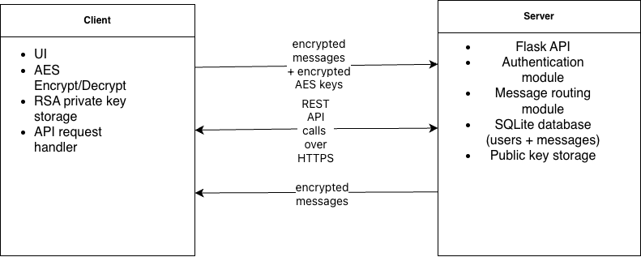

Mariyah Marshall Senior Project

**System Architecture Overview**

My chat application uses a client-server architecture in which the client performs all encryption and decryption, while the server acts as a secure relay and storage layer. This design ensures end-to-end encryption and prevents the server from accessing the plaintext messages.

---

**Client Responsibilities**

The client handles the core security functions of the application, including:
- Performing AES encryption of outgoing messages
- Performing AES decryption of incoming messages
- Generating and securely storing the user's RSA private key
- Retrieving other users’ public keys from the server
- Encrypting the AES session key with the recipient’s public RSA key
- Sending encrypted messages and encrypted AES keys to the server
- Displaying the user interface for login, registration, sending messages, and viewing message history, using data retrieved from the server’s API

---

**Server Responsibilites**

The server acts as a secure backend that never sees plaintext:
- Handling user registration and login through secure authentication endpoints
- Hashing and storing user passwords
- Storing public keys for each user
- Receiving encrypted messages and encrypted AES keys
- Storing messages in the SQLite database
- Routing messages to the correct recipient
- Making REST API endpoints available for operations such as authentication and message handling
- Never storing or accessing private keys or plaintext messages

---

**Data Flow Between Client and Server**

 This shows how information moves through the system during registation, login, message sending, and message retrieval
#### 1. Registration Flow
- User enters username and password
- Client generates an RSA keypair
- Client sends the username, hashed password, and public key to the server
- Server stores the user record and public key

#### 2. Login Flow
- Client sends username and password
- Server verifies the password hash
- Server returns a success or failure response.

#### 3. Sending a Message
- Client generates a random AES key
- Client encrypts the message using AES
- Client encrypts the AES key with the recipient’s RSA public key
- Client sends the encrypted message and encrypted AES key to the server
- Server stores the message and marks it as undelivered

#### 4. Receiving a Message
- Client requests messages from the server
- Server returns the encrypted message and encrypted AES key
- Client decrypts the AES key using its RSA private key
- Client decrypts the message using AES
- Client displays the plaintext message to the user

---

**Communication Protocols**

The system uses secure, structured communication standards to ensure confidentiality and reliable client–server interaction.
- HTTPS for secure transport
- REST API for communication between client and server
- JSON used for request/response bodies
- Endpoints include:
  - /register
  - /login
  - /messages/send
  - /messages/get

The system uses HTTPS to protect data in transit and RESTful API endpoints to support all client–server operations.

---

**High-Level Architecture Diagram (Description)**

#### Client Side
- UI
- AES encryption/decryption
- RSA private key storage
- API request handler

#### Server Side
- Flask API
- Authentication module
- Message routing module
- SQLite database (users + messages)
- Public key storage

#### Arrows
- Client → Server: encrypted messages + encrypted AES keys
- Server → Client: encrypted messages
- Client ↔ Server: REST API calls over HTTPS